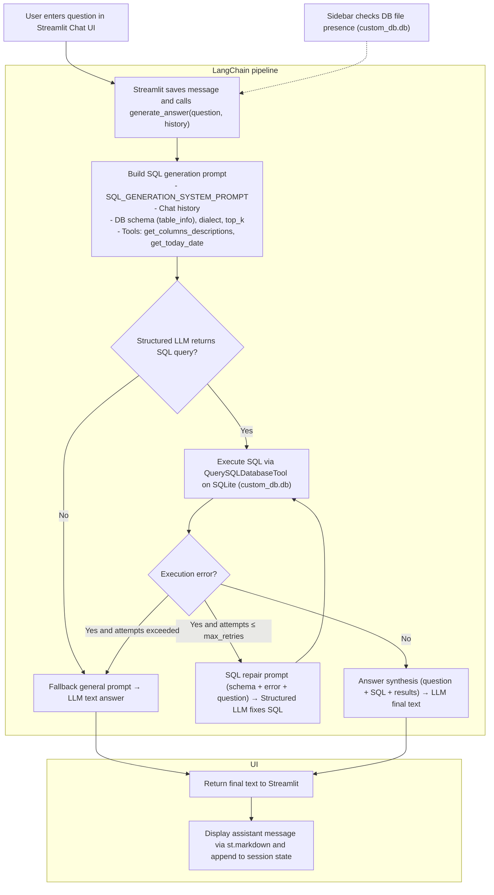

# GenAI SQL Analysis (HR Analytics Prototype)

An interactive Streamlit app for exploring HR data and asking natural-language questions powered by Azure OpenAI + LangChain. The app generates SQL over a SQLite database, executes it with a repair loop, and synthesizes concise answers.

### Features

- HR AI Agent: ask questions in natural language, get data-grounded answers from `custom_db.db`.
- EDA Analysis: explore department headcount, team size distribution, and attrition trends.
- One-click example questions and system status on the homepage.

---

## Prerequisites

- Python 3.13+ (recommended); project is configured for modern Python. If you have `uv`, you can use it instead of `pip`.
- An Azure OpenAI deployment (for the HR AI Agent).

## Quickstart

1. Create and activate a virtual environment

```powershell
# Windows PowerShell
python -m venv .venv
# or, with uv
# uv venv
. .venv/Scripts/Activate.ps1
```

```bash
# macOS / Linux
python3 -m venv .venv
# or, with uv
# uv venv
source .venv/bin/activate
```

2. Install dependencies

```bash
pip install -r backend/requirements.txt
# or, with uv
# uv pip install -r backend/requirements.txt

```

3. Configure environment variables (Azure OpenAI)

Create `backend/.env` with the following keys:

```dotenv
AZURE_OPENAI_API_KEY=...
AZURE_OPENAI_ENDPOINT=...
AZURE_OPENAI_API_VERSION=...
AZURE_OPENAI_DEPLOYMENT=...
```

4. Create the SQLite databases from the CSV

```bash
cd backend
python eda/insert_data.py
```

This will generate both `backend/data/sql/custom_db.db` and `backend/data/sql/original_db.db` using `backend/data/csv/employee_data_15000.csv`.

5. Run the app

```bash
cd backend
python main.py
```

Note: running from the `backend` directory ensures imports like `core.*` work without extra `PYTHONPATH` setup.
But in case there are import errors, run this in the terminal while inside `backend` directory.

```powershell
$env:PYTHONPATH = (Resolve-Path '../backend').Path
```

---

## Project structure

```
backend/
  app/
    Homepage.py                 # Landing page with status, quick start, navigation
    pages/
      EDA analysis.py          # Interactive EDA dashboards
      HR AI agent.py           # Chat UI for the HR AI Agent
  agent/
    langchain.py               # Orchestrates SQL generation, execution, answer synthesis
    langchain_providers.py     # LLM + SQLite DB providers
    function_tools.py          # Helper tools (column descriptions, today date)
    tools_constants.py         # Few-shot examples and column descriptions
  core/
    app_config.py              # Paths to CSV/DB files
    env.py                     # Loads env vars from backend/.env
  eda/
    runtime_queries.py         # SQL helpers used by EDA pages
    insert_data.py             # Builds SQLite DBs from CSV
    eda_analysis.py            # EDA summary generation
  data/
    csv/employee_data_15000.csv
    sql/custom_db.db
    sql/original_db.db
```

---

## HR AI Agent workflow



---

## Troubleshooting

- Custom DB not found: run `python backend/eda/insert_data.py`. The homepage shows expected paths and row counts.
- LLM config missing: set keys in `backend/.env`. The homepage indicates whether Azure OpenAI config is detected.
- Import errors when launching: run from `backend` directory: `cd backend && streamlit run app/Homepage.py`.

---
